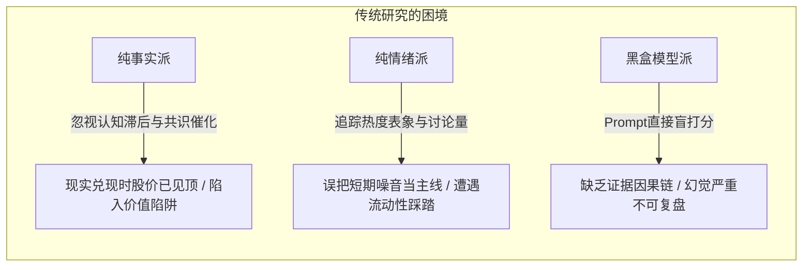

<div align="center">

# 市场叙事生命周期研究系统
### Narrative Lifecycle: The State Transition Dynamics of Market Cognition

**一套基于“名、资、实、势”认知演化闭环与泊松跳跃状态机的二级市场宏大叙事量化研究系统。**

[](https://github.com/Waloncycler/narrative-lifecycle/actions)
[](LICENSE)
[-darkgreen.svg)](docs/theory/市场叙事生命周期理论_第一版.md)
[](docs/theory/市场叙事生命周期理论_第一版.pdf)
[](https://nodejs.org/)
[](CONTRIBUTING.md)

[序言：时代之问](#一序言时代之问与历史坐标) · [哲学本体论](#二哲学本体论名实之辩与反身性涌现) · [物理与数学模型](#三状态跃迁动力学泊松过程与状态机) · [八阶生命周期](#四生命周期全景s0-到-s7-的状态跃迁演化) · [终极决策推演](#五投资决策推演从认知跃迁到资本Alpha) · [架构与工程实现](#六宏伟工程体系数据流与Feature-Sliced架构) · [快速上手](#七全流程实操指南-run-the-system)

</div>

---

> 🏛️ **研究宣言 / Research Manifesto**  
> 二级市场是人类社会最敏锐、最激烈的认知实验室。  
> 我们不交易冷冰冰的事实本身，也不交易脱离现实的虚妄故事；我们交易的是**人类共同认知在不确定性世界中完成状态跃迁的概率密度，以及这种跃迁引爆资本重配与现实验证的正反馈之“势”**。  
> 
> 本项目贯彻不可动摇的第一性原则：  
> **`Evidence first. Rules second. LLM explanation third.`**  
> （事实证据第一，确定性规则第二，大模型阐释第三）

---

## 一、序言：时代之问与历史坐标

### 1.1 为什么我们需要重构市场认知科学？

翻开人类商业与科技文明的波澜史册，从大航海时代的香料贸易、工业革命的蒸汽机与铁路狂热，到信息时代的互联网浪潮、移动互联、新能源变革，再到当下席卷全球的生成式 AI、人形机器人、商业航天与可控核聚变——**每一次文明级生产力的跃迁，都在二级市场上演着完全同构的悲喜剧**。

在长期的投资与研究实践中，每一个严肃的思考者都会遭遇直击灵魂的“名实之惑”：

- **同样一份突破性订单**：为何有时能引爆横跨数季度的翻倍主升浪，有时却在公告次日遭遇无情的“利好出尽”高开低走？
- **同样一项前沿科学突破**：为何有时被迅速建构为重塑全球竞争格局的产业史诗，有时却被冷落在研报角落沦为一日游脉冲？
- **同样一份重磅产业政策**：为何有时能汇聚千亿资金形成长达数年的大主线，有时却在媒体喧嚣过后迅速归于死寂？



传统研究范式的失效，根源于它们割裂了“事实的发生”与“认知的演变”：
1. **纯基本面派**以为价格由静态事实决定，却忽略了事实在被市场采纳前必须经历漫长的**解释、标签化与定价共识**；
2. **纯情绪热度派**以为讨论量即是力量，却无法分辨什么是**一次性情绪消耗**，什么是**具备产业外推能力的叙事结构**；
3. **黑盒大模型派**试图用端到端的 Prompt 猜测股价涨跌，彻底抛弃了因果证据链，既无法对抗幻觉，更无法在历史长河中积累可沉淀的认知资产。

---

### 1.2 历史使命：构建确定性的叙事状态变化探测器

我们构建 **Narrative Lifecycle（市场叙事生命周期系统）**，正是为了结束这种混乱与虚妄。

这不是一个简单的股票热点排行榜，不是一个买卖信号生成器，更不是一个黑盒自动交易程序；  
它是一个**严密的、基于物理学与认知科学的 Narrative State Change Detector（叙事状态变化识别系统）**。

它旨在为全球宏观配置者、产业研究员、量化投资人提供一个**透明、可证伪、带证据溯源的微观认知透视镜**，精确回答关于任意一个产业叙事的四个终极问题：
1. **当前阶段**：该叙事在历史演化图谱中，精确处于 $S_0 \sim S_7$ 的哪一个量子化状态？
2. **跃迁动因**：是哪一条具备权威度与信息增量的核心证据，推动了状态跳变？
3. **晋升阻力**：为什么它目前无法被赋予更高的认知阶段？卡在哪个现实断层？
4. **验证路径**：在未来的时空坐标中，需要跟踪哪一项具体的现实数据来完成证真或证伪？

---

## 二、哲学本体论：名实之辩与反身性涌现

```
                     ┌───────────────────────────────┐
                     │          名 (Perception)       │
                     │    共同解释框架 / 标签化认知    │
                     └───────────────┬───────────────┘
                                     │  共识测试 (S4)
                                     ▼
                     ┌───────────────────────────────┐
                     │     资 (Capital Allocation)   │
                     │    机构定价采纳 / 资本系统重配  │
                     └───────────────┬───────────────┘
                                     │  产业扩产 / 订单验证 (S5->S6)
                                     ▼
                     ┌───────────────────────────────┐
                     │    实 (Reality Validation)    │
                     │    物理世界订单 / 报表 / 供应链 │
                     └───────────────┬───────────────┘
                                     │
                                     ▼
                     ┌───────────────────────────────┐
                     │     势 (Evolution Loop)       │
                     │    自增强正反馈 / 叙事树裂变   │
                     └───────────────────────────────┘
```

### 2.1 从《管子》“名实相符”到现代社会建构

中国先秦名家与管子曾提出深刻的政治哲学命题：“审其名实，慎其所谓”。而在高度现代化的二级资本市场，**“名”与“实”的互动演化被推向了极致**：

1. **叙事（Narrative）的本质是“共同解释框架”**：  
   事件本身不具备天然的交易属性。例如 DeepSeek 的发布，可以被解释为“国产大模型算力突围”，可以被解释为“推理成本断崖下跌利好终端应用”，也可以被解释为“开源模型对闭源生态的冲击”。**事件相同，叙事不同；叙事不同，资本流向与资产定价的维度截然相反。** 叙事不是讲故事，而是市场参与者为了压缩宇宙复杂信息而共同构建的意义坐标。

2. **名开资路，资催实生，实反馈势**：  
   - 当微弱的科学信号（名）完成标签化与共识测试，它就打开了资本市场配置（资）的大门；
   - 资本的汹涌流入不仅拉动股票估值，更会溢出到实体产业：驱动一级市场风投、促使上市公司定增加码、吸引地方政府产业基金落地、激发供应链备货与工程师集聚；
   - 广义资本的承诺最终孵化出真实的物理世界成果（实）：大客户框架协议、量产交付、毛利改善；
   - 现实验证的兑现，反过来极度强化最初的认知，形成**自增强的“势”（Evolution Loop）**。

---

### 2.2 索罗斯反身性在叙事维度的升维表达

乔治·索罗斯（George Soros）揭示了金融市场的参与者认知与客观现实之间的反身性（Reflexivity）。本项目将这一哲学思想进行了**离散化、数学化与工程化**：

$$\text{势 (Evolution Momentum)} = \oint \Big( \text{Perception} \longrightarrow \text{Capital} \longrightarrow \text{Reality} \longrightarrow \text{New Perception} \Big)$$

- **主流化（Mainstream）**：闭环各环节无缝传导，现实兑现持续击穿悲观预期，叙事演化为长期时代主线（如新能源车渗透率从 5% 跨越至 40%）；
- **透支与衰退（Exhaustion）**：现实兑现节奏（Reality Speed）追不上已被资本打满的狂热预期（Priced Expectation），反身性闭环断裂，遭遇杀估值与流动性枯竭；
- **再叙事化（Mutation）**：原叙事树枯竭前，枝桠孕育出全新的子叙事（如“移动互联网”演化出“移动支付”、“O2O”、“短视频”、“直播电商”），开启次级生命周期。

---

## 三、物理与数学模型：状态跃迁动力学与泊松过程

### 3.1 为什么是“泊松跳跃”而非“连续布朗运动”？

经典金融工程学（如 Black-Scholes 模型）假定资产价格遵循连续对数正态扩散过程。但在真实市场的认知世界里，**超额 Alpha 从来不是连续均匀释放的，而是由一系列离散的、量子化的状态跳变所驱动**。

```
认知成熟度 (Cognitive State)
  S6 ───┐                                            ╭──────── (主流化/S7)
  S5 ───┼───────────────────────────╭───────────────╯
  S4 ───┼─────────────────╭─────────╯  (Transition Event: 龙头确认/机构覆盖)
  S3 ───┼───────────╭─────╯  (Accumulation Events: 供应链验证/专利密集发布)
  S2 ───┼─────╭─────╯  (Poisson Intensity λ(t) 跃迁)
  S1 ───╭─────╯  (Attention Trigger)
  S0 ───╯  (Latent Signal)
        ──────────────────────────────────────────────────► 时间 (Time)
```

我们将事件划分为两类物理微观粒子：
1. **Accumulation Events（积累型隐性事件群）**：如偶发论文、原型机测试、小单试用、外围探讨。它们不直接改变价格，但会使得系统内部的**跳变强度参数 $\lambda(t)$ 持续升温**；
2. **Transition Event（跃迁临界显性事件）**：在 $\lambda(t)$ 达到临界阈值时爆发的标志性事件（如重磅产品发布会、国家顶层规划出台、核心龙头首板封单），直接触发市场认知状态从 $S_i$ 跃迁至 $S_{i+1}$。

---

### 3.2 跃迁动力学总方程 (The Transition Force Equation)

任意主题在任意时刻能否跨越当前阶段门槛，由**跃迁合力方程**精确解算：

$$\bbox[15px,border:2px solid #2563eb]{ P(S_i \to S_{i+1}) = \sigma \Big( \mathbf{F}_{\text{Driving}} - \mathbf{F}_{\text{Friction}} + \mathbf{F}_{\text{Feedback}} \Big) }$$

其中：

#### 1. 驱动合力 $\mathbf{F}_{\text{Driving}}$
$$\mathbf{F}_{\text{Driving}} = w_1 \cdot \text{Auth} + w_2 \cdot \text{Dense}_{\text{interp}} + w_3 \cdot \text{Label}_{\text{clarity}} + w_4 \cdot \text{Lead}_{\text{strength}} + w_5 \cdot \text{Diff}_{\text{orderly}} + w_6 \cdot \text{Ev}_{\text{density}}$$
- $\text{Auth}$：信源权威度（如国家部委、顶级学术期刊、龙头公告 vs 匿名自媒体）；
- $\text{Dense}_{\text{interp}}$：解释性内容密度（市场在追问“这意味着什么”的讨论占比）；
- $\text{Label}_{\text{clarity}}$：标签收敛度（全市场是否统一定义了该主题的交易语言）；
- $\text{Lead}_{\text{strength}}$：叙事龙头强度（是否具备订单、技术、行业地位三位一体的信心锚）；
- $\text{Diff}_{\text{orderly}}$：扩散有序度（资金是否严格沿着产业链自上而下扩散）；
- $\text{Ev}_{\text{density}}$：核心事实证据密度（单位时间窗口内新增 E2-E4 证据数量）。

#### 2. 摩擦阻力 $\mathbf{F}_{\text{Friction}}$
$$\mathbf{F}_{\text{Friction}} = v_1 \cdot \text{Crowd}_{\text{val}} + v_2 \cdot \text{Cap}_{\text{illiquid}} + v_3 \cdot \text{Gap}_{\text{reality}} + v_4 \cdot \text{Risk}_{\text{policy}}$$
- $\text{Crowd}_{\text{val}}$：估值透支度（价格是否已透支未来数年的乐观假设）；
- $\text{Cap}_{\text{illiquid}}$：承接容量瓶颈（标的市值过小或流动性不足以容纳中长期机构资金）；
- $\text{Gap}_{\text{reality}}$：现实断层风险（实验室技术与产业化量产之间存在不可逾越的物理/商业鸿沟）；
- $\text{Risk}_{\text{policy}}$：合规与地缘摩擦阻力。

#### 3. 反身反馈 $\mathbf{F}_{\text{Feedback}}$
$$\mathbf{F}_{\text{Feedback}} = u_1 \cdot \big( \Delta \text{Price} \times \Delta \text{Attention} \big) + u_2 \cdot \big( \text{Capital}_{\text{inflow}} \times \text{Industry}_{\text{capex}} \big)$$
- 衡量价格上涨引发的注意力回流，以及资本市场热度转化为实体产业扩产的自反性强度。

---

## 四、生命周期全景：S0 到 S7 的状态跃迁演化

```
               【叙事生命周期 S0-S7 状态跃迁全景矩阵】
┌──────┬─────────────────────────┬──────────────────────┬────────────────────────┬──────────────────────┐
│ 阶段 │ 阶段名称与定位           │ 核心判定标准 (Gate)   │ 最佳 Alpha 捕获策略     │ 典型失效与熔断特征    │
├──────┼─────────────────────────┼──────────────────────┼────────────────────────┼──────────────────────┤
│  S0  │ Latent Signal (潜伏信号)│ 零散弱事实，无市场语言│ 前瞻建观察池，低成本埋伏│ 信号太专业孤立，被遗忘│
│  S1  │ Attention (注意力唤醒)  │ 权威触发，搜索/成交异动│ 信息发现 Alpha，速度优势│ 孤立假新闻，一日游脉冲│
│  S2  │ Hypothesis (假说形成)   │ 解释涌现，探索方向意义│ 认知建构 Alpha，胜率跃升│ 逻辑过于冗长，无法映射│
│  S3  │ Labeling (标签收敛)     │ 压缩为极简词汇与股票池│ 主题投资 Alpha，主线确立│ 标签抽象泛化，无法交易│
│  S4  │ Consensus (共识测试)    │ 龙头领涨，产业链有序扩散│ 交易型 Alpha (弹性黄金期)│ 龙头断板后板块瞬间瓦解│
│  S5  │ Pricing (定价采纳)      │ 机构研报重构盈利/估值 │ 中期趋势 Alpha，机构加仓│ 无法量化建模，估值透支│
│  S6  │ Reality (现实验证)      │ 订单/财报/排产闭环兑现│ 预期差 Alpha (超预期捕捉)│ 现实兑现低于被打满预期│
│  S7  │ Mutation (演化与分岔)   │ 主流化 / 衰退 / 裂变   │ 生命周期管理，精准逃顶│ 极度拥挤，利好钝化杀跌│
└──────┴─────────────────────────┴──────────────────────┴────────────────────────┴──────────────────────┘
```

### 4.1 S0 → S1: 潜伏信号到注意力唤醒 (The Spark)
- **微观物理表象**：ArXiv 上一篇冷门论文、国家知识产权局一项发明专利、海外科技巨头一个默默上线的开源仓、偏远供应链一次零部件试产；
- **跃迁临界点**：被**权威主体（行业领军人/顶级部委）**背书，或出现**个别标的异常异动**，使信息从“客观存在”跨越到“被市场看见”；
- **量化指标**：`Attention Trigger Score`（权威度权重 $\times$ 新颖性 $\times$ 标的承接力）。

### 4.2 S1 → S2: 注意力到叙事假说 (The Interpretation)
- **微观物理表象**：全市场不再满足于“发生了什么”，而开始激烈争夺“这意味着什么”。券商电话会、KOL 讨论、行业专家访谈呈现爆发式增长；
- **跃迁临界点**：解释版本由发散走向收敛。例如多方观点开始统一到“这是算力成本降低 90% 的工业革命信号”；
- **量化指标**：`Interpretation Density`（解释密度）与 `Hypothesis Coherence`（假说收敛度）。

### 4.3 S2 → S3: 叙事假说到标签化 (The Compression)
- **微观物理表象**：复杂的产业推演被高度提炼为**不可逆的极简符号**（如“低空经济”、“CPO”、“具身智能”、“液冷超充”）。炒股软件开辟独立板块，股票池归属清晰；
- **跃迁临界点**：同一标签在主流券商晨会、财经头条与交易者社群中被高频复用；
- **量化指标**：`Labeling Score`（关键词聚合度与标的映射纯度）。

### 4.4 S3 → S4: 标签化到共识测试 (The Price Testing)
- **微观物理表象**：资金开始动用真金白银测试标签的承载力。叙事龙头横空出世，二线标的开始寻找产业链补涨，板块呈现“梯队式纵深”；
- **跃迁临界点**：第一次遭遇大盘剧烈调整或分歧回调时，能够实现**强承接与反包修复**；
- **量化指标**：`Consensus Testing Probability`（龙头强度 $\times$ 板块纵深扩散度 $\times$ 回撤修复韧性）。

### 4.5 S4 → S5: 共识测试到定价采纳 (The Institutional Adoption)
- **微观物理表象**：从游资情绪博弈彻底演进为**公募、保险、外资等长线机构资金的系统性配置**。研报不再是“概念科普”，而是直接出现 DCF 现金流折现、渗透率 S 曲线、单机价值量（BOM 拆解）与未来三年 EPS 弹性测算；
- **跃迁临界点**：标的从中小型概念股扩展至千亿市值行业领头羊，ETF 份额持续膨胀；
- **量化指标**：`Pricing Adoption Score`（机构研报覆盖增量 $\times$ 估值模型重构度 $\times$ 大市值流动性承载力）。

### 4.6 S5 → S6: 定价采纳到现实验证 (The Reality Check)
- **微观物理表象**：季度财报、月度排产数据、大客户采购订单、海外出口报关单接踵而至。市场从“买入梦想”进入“用尺子丈量现实”；
- **跃迁临界点**：**证据网络闭合（Evidence Network Coherence）**。单点订单可能造假，但上游设备出货、中游排产利用率与下游大客户财报必须严密吻合；
- **核心风险**：**预期差陷阱**。现实很好，但市场在 S5 已经给出了“三年翻十倍”的定价，导致“利好兑现之日即是阴跌之时”；
- **量化指标**：`Reality Validation Score`（订单金额持续性 $\times$ 毛利率杠杆 $\times$ 预期差弹性 $\Delta \text{Gap}$）。

### 4.7 S6 → S7: 终局分岔 (The Grand Divergence)
现实验证之后，叙事将不可逆地滑向三条命运分岔线：
- **S7A 主流化 (Mainstream)**：形成长期结构性资产（如云计算、新能源动力电池、光伏出海），估值体系从 PE 转向成熟期 PEG 或股息模型；
- **S7B 衰退与透支 (Exhaustion)**：现实无法承载过高预期，叙事被证伪或行业产能过剩，遭遇双杀；
- **S7C 再叙事化 (Mutation & Narrative Tree)**：母叙事裂变，孵化出全新的子生命周期（如 AI 从大模型裂变出 AI Agent、端侧 AI、具身智能），开启新一轮 S0-S6。

---

## 五、投资决策推演：从认知跃迁到资本 Alpha

本系统不产生机械的“买入/卖出”黑盒信号，而是将宏大的叙事生命周期转化为**胜率与赔率兼备的量化决策矩阵**：

```
                             【二级市场投资决策映射矩阵】
  高赔率 ──┐
          │      [S0 潜伏]                 [S2 假说 / S3 标签]
          │   (胜率低/赔率极高)             (胜率爬升 / 爆发力极强)
          │  ★ 策略：低成本广泛埋伏         ★ 策略：重仓参与主升浪
          │
          │──────────────────────────────────────────────────────────
          │
          │      [S6 现实验证]              [S4 共识 / S5 定价]
          │   (胜率最高/空间压缩)           (机构加仓 / 确定性最高)
          │  ★ 策略：挖掘预期差超预期      ★ 策略：顺势趋势配置
  低赔率 ──┴──────────────────────────────────────────────────────────►
            低胜率                                              高胜率
```

### 5.1 黄金狩猎区间：$S_2 \to S_5$
- **$S_0 \sim S_1$ 的局限**：太早，充满科学与政策噪音，时间成本过高；
- **$S_6 \sim S_7$ 的局限**：太晚，人人皆知，股价早已充分 Priced-in，稍有瑕疵便触发暴跌；
- **$S_2 \sim S_5$ 的暴利空间**：这是**市场共同认知从萌芽走向机构主流共识的核心通道**。在此阶段，估值乘数（P/E 或 P/S）随着认知跃迁发生倍数级重估（戴维斯双击的前半场），流动性溢价与基本面预期同时共振，是全周期收益风险比最高、容纳资金体量最大的黄金猎场。

### 5.2 预期差量化方程 (Expectation Alpha Formulation)
在 S5 至 S6 阶段，Alpha 不再取决于事实本身的好坏，而取决于**现实兑现速度与市场定价速度的时空差**：

$$\text{Alpha}_{\text{Reality}} = \text{Velocity}\big(\text{Reality Evolution}\big) - \text{Velocity}\big(\text{Priced Expectation}\big)$$

1. 当 $\text{Alpha}_{\text{Reality}} > 0$：现实超预期，估值天花板再次被掀开，享受超额红利；
2. 当 $\text{Alpha}_{\text{Reality}} \le 0$：哪怕公司业绩翻倍，只要此前市场定价了“翻三倍”，系统将立即发出 **`S7B Risk Flag`（利好钝化与拥挤度熔断预警）**。

---

## 六、宏伟工程体系：数据流与 Feature-Sliced 架构

为了承载如此庞大而严谨的认知演化推演，我们构建了**工业级、零污染的 Feature-Sliced（特性切片）工程架构**：

```
src/
├── features/               # 独立业务切片 (领域规则纯粹，严禁外部 I/O 污染)
│   ├── evidence/           # 证据表、哈希指纹防篡改、E0-E4 证据强度规则
│   ├── stages/             # S0-S7 状态机、Stage Gate 门槛判定、周期 Diff
│   ├── scoring/            # 纯规则打分引擎、转移概率动力学计算
│   ├── narrative/          # 叙事树图谱、Narrative Memory 记忆库、主题注册表
│   ├── intake/             # 证据录入 Agent、主动学习闭环、本地可视化工作台
│   ├── research/           # 自主研究 Agent、Web 深度检索、直接数据源巡航
│   ├── worldmonitor/       # 43+ 权威情报网格编目、Feed 提纯、状态变化探测
│   └── reporting/          # Dashboard 状态卡、周度简报、历史回放测试
├── platform/               # 跨业务通用基础设施 (文件存储、运行上下文、版本控制)
├── app/                    # 组合根：业务用例编排、完整流水线串联
└── cli/                    # 极简 CLI 入口 (严格对齐每个 npm run 命令)
```

```mermaid
flowchart TD
    subgraph 外部权威数据宇宙 (43+ Sources)
        S1[全球宏观与金融: Investing/Reuters/WSJ/Bloomberg]
        S2[官方监管与法定: SEC EDGAR/Federal Register/SAMR/CAC]
        S3[顶级学术与科技: PubMed/ArXiv/OpenAlex/Crossref]
        S4[产业与公司披露: 30家核心公司IR/交易所公告/招投标]
    end

    subgraph 提纯与证据准入
        S1 & S2 & S3 & S4 --> WM[WorldMonitor 结构化特征提纯]
        WM --> IC[Evidence Candidate 候选提纯 (含原文引用与置信度)]
        IC --> AG[AI Shadow 影子验证 (MiniMax/自定义接口)]
        IC & AG --> HG{人类审查道闸 (Review Gate)}
    end

    subgraph 确定性状态机核心 (Pure Domain)
        HG -->|通过审核| ET[正式证据表 (Evidence Table)]
        ET --> NM[叙事记忆库 (Narrative Memory)]
        NM --> SG[Stage Gate 状态门槛分类器 (S0-S7)]
        SG --> SE[动力学打分引擎 (Transition Force 计算)]
    end

    subgraph 最终决策看板与产出
        SE --> DC[Dashboard 状态卡 (outputs/dashboard_cards/)]
        SE --> SD[状态迁移对比 (outputs/diffs/latest_stage_diff.md)]
        SE --> WB[周度战略简报 (outputs/reports/weekly_brief.md)]
        SE --> UI[Narrative Monitor 交互式工作台 (127.0.0.1:4177)]
    end
```

---

## 七、全流程实操指南 (Run The System)

### 7.1 环境准备与三步启动

```bash
# 1. 克隆完整代码库
git clone https://github.com/Waloncycler/narrative-lifecycle.git
cd narrative-lifecycle

# 2. 安装工程依赖并初始化环境
npm install
cp .env.example .env    # 可选：填入 MiniMax 或兼容的大模型 API Key

# 3. 启动交互式叙事监控大盘与工作台
npm run intake:workbench
```

浏览器访问 **`http://localhost:4177`** 即可进入沉浸式 Narrative Monitor 作战控制台！

---

### 7.2 核心操作命令完整全景

```bash
# ── 1. 证据录入与可视化工作台 ────────────────────────────────────
npm run intake:workbench              # 启动本地可视化工作台 (127.0.0.1:4177)
npm run evidence:validate             # 校验手动录入的证据草稿结构与模式
npm run evidence:import -- --file <p> # 将审查合格的证据正式安全并入 Evidence Table

# ── 2. 状态机推演与周期简报 ────────────────────────────────────
npm run pipeline                      # 运行全市场主题的 S0-S7 状态判定与打分计算
npm run diff                          # 比对历史快照，输出状态跃迁与证据增量 Diff
npm run report                        # 生成面向高级研究员的周度叙事洞察简报
npm run weekly                        # 一键执行标准化全流程：pipeline -> diff -> report

# ── 3. 全球权威情报源同步网格 ─────────────────────────────────
npm run sources:inventory             # 审查已注册的 43 个全球顶级数据源配置清单
npm run sources:sync -- --mode sandbox# 沙盒模式安全同步测试（不污染生产数据库）
npm run sources:sync -- --mode live   # 生产模式实时抓取最新动态

# ── 4. 自主巡航与深度线索分诊 ─────────────────────────────────
npm run research:campaign             # 发起全天候多主题跨域研究巡航任务
npm run research:triage               # 对海量外部线索按权威度与时效进行自动分诊
npm run research:retrieve -- --max 6  # 对高优先级线索抓取原文可复核真实摘录
npm run research:baseline             # 针对 S0 潜伏期核心主题生成阶段基准核验单

# ── 5. 影子 AI 与治理型主动学习 ─────────────────────────────────
npm run intake:ai-shadow              # 启动 AI 影子比对候选（仅作提示，不自动入库）
npm run intake:ai-evaluate            # 针对 50 篇标准测试集评估 AI 候选抽取精确度
npm run intake:learning-cycle         # 沉淀人类修正偏好，更新自适应建议画像

# ── 6. 历史叙事回放与回测验证 ─────────────────────────────────
npm run replay                        # 运行基于时间切片的历史叙事回放回测
npm run pilot:init                    # 初始化实盘跟踪观察账本
npm run pilot:review                  # 生成实盘试点课题追踪与校验评估报告

# ── 7. 代码工程与质量守卫 ───────────────────────────────────────
npm run typecheck                     # TypeScript 严苛模式全量类型检查
npm test                              # 运行 Vitest 自动化单测体系 (390+ Tests 全部通过)
```

---

## 八、理论著作与核心文献 (Documentation)

| 领域 | 核心文献路径 | 核心要义说明 |
|---|---|---|
| 📕 **理论巨著** | [《市场叙事生命周期理论 · 第一版》(Markdown 全文)](docs/theory/市场叙事生命周期理论_第一版.md)<br>[《市场叙事生命周期理论 · 第一版》(PDF 原版)](docs/theory/市场叙事生命周期理论_第一版.pdf) | **理论奠基之作（全本 12 章 + 附录）**<br>从名实差、泊松过程到状态机动力学的完整哲学与数学建构 |
| 📐 **规则基石** | [01 · 名、资、实、势理论总纲](docs/01_theory_name_capital_reality_momentum.md)<br>[02 · S0 到 S7 八阶状态定义](docs/02_lifecycle_states_S0_S7.md)<br>[03 · 最低证据标准与准入门槛](docs/03_minimum_evidence_standards.md)<br>[06 · 定量评分系统 (v0.2)](docs/06_scoring_system_v0_2.md) | 状态分类机判定、E0-E4 证据链分级与定量指标 |
| 🛡️ **质量治理** | [04 · 误分类纠错规则体系](docs/04_misclassification_correction_rules.md)<br>[08 · 失败案例库与反思](docs/08_failure_case_library.md)<br>[26 · 治理型主动学习框架](docs/26_governed_active_learning.md) | 防范概念炒作、假叙事、过拟合与认知偏差的防火墙 |
| 🌐 **数据集成** | [07 · 数据源与证据表设计](docs/07_data_sources_and_evidence_table.md)<br>[27 · 全球权威数据源集成地图](docs/27_worldmonitor_data_sources_integration_map.md) | 涵盖监管、学术、媒体、财报的 43+ 权威情报网格 |
| 💻 **实操手册** | [EVIDENCE_GUIDE (证据编写手册)](docs/EVIDENCE_GUIDE.md)<br>[OPERATOR_GUIDE (操作员指南)](docs/OPERATOR_GUIDE.md)<br>[REPLAY_GUIDE (历史回放指南)](docs/REPLAY_GUIDE.md)<br>[TROUBLESHOOTING (故障排查)](docs/TROUBLESHOOTING.md) | 面向分析师与工程师的零代码/低代码实操规范 |

---

## 九、金标准真实案例 (Golden Cases)

代码库中内置了 3 个经过严密历史复盘与人工标注的金标准叙事全周期演化样本：

1. 🧬 [`data/golden_cases/bci.yaml`](data/golden_cases/bci.yaml) — **脑机接口 (BCI)**：从学术论文与临床批准 ($S_0$)、注意力唤醒 ($S_1$)、到资本共识测试 ($S_4$) 的演化轨迹；
2. 🤖 [`data/golden_cases/humanoid_robotics.yaml`](data/golden_cases/humanoid_robotics.yaml) — **人形机器人 (Humanoid Robotics)**：从特斯拉概念发布、硬件降本假说到零部件产业链（减速器/丝杠/传感器）大面积扩散；
3. 💊 [`data/golden_cases/innovative_drug_license_out.yaml`](data/golden_cases/innovative_drug_license_out.yaml) — **创新药出海 License-out**：从海外临床数据读出到首付款、里程碑商业化真实兑现 ($S_6$) 的完整闭环。

---

## 十、开源共建与路线图 (Contributing & Roadmap)

我们坚信，未来的投资研究范式必将从“凭感觉的故事讲述”演进为“基于证据状态机的科学探索”。

### 10.1 贡献方向
- 🔌 **数据源适配器**：在 `src/features/worldmonitor/io/` 中接入更多全球官方机构、学术文献库与交易所 API；
- 📝 **产业证据样本**：在 `data/sample_evidence/` 中扩充可控核聚变、量子计算、低空经济、合成生物等赛道的标准证据 YAML；
- 🧠 **行业认知规则包**：在 `src/features/reporting/domain/industry_packs.ts` 中丰富行业专有名词与判定启发式。

### 10.2 发展路线图
- [x] **v0.13**：完成 43 个全球权威情报源网格、S0-S7 状态机动力学方程、Feature-Sliced 模块化重构；
- [ ] **v0.14**：接入高性能 SQLite / PostgreSQL 持久化引擎，支持海量历史事件高并发检索；
- [ ] **v0.15**：构建分布式多人协同 Web 研究中枢（支持投研团队共享叙事池与批注工作流）；
- [ ] **v0.16**：接入彭博 (Bloomberg Terminal)、万得 (Wind Data)、Refinitiv 机构级金融数据接口；
- [ ] **v0.17**：发布 Python Quant SDK，支持量化团队在 Jupyter Notebook 中无缝调用叙事状态转移因子。

---

## 许可证 (License & Integrity)

本项目采用 [MIT License](LICENSE) 协议开源。

```
Copyright (c) 2026 Narrative Lifecycle Contributors
```

<div align="center">
<b>致敬所有在喧嚣与泡沫中坚持寻找确定性、相信“事实与逻辑先于叙事”的严肃研究者。</b><br>
<sub>Dedicated to serious researchers who seek truth from facts amidst market noise.</sub>
</div>
